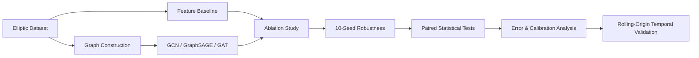

# Fraud Detection with Graph Neural Networks

[](https://github.com/Ignite7871/Fraud-Detection-GNN/actions/workflows/tests.yml)

A graph-based fraud detection research project using the **Elliptic Bitcoin Transaction Dataset** to investigate whether transaction relationships provide useful information beyond transaction-level features — and whether that answer depends on which model, evaluation protocol, or chronological cutoff is used.

The project compares a **Logistic Regression baseline** (with and without a simple neighborhood-aggregate feature) against three two-layer graph neural network architectures — **GCN**, **GraphSAGE**, and **GAT** — under both a random split and a chronological (temporal) split, with 10-seed statistical validation, per-model error/calibration analysis, and a rolling-origin robustness check across multiple chronological cutoffs.

---

## ⚡ Project Snapshot

> **Research question:** Does graph structure actually improve illicit-transaction detection, and do the conclusions survive architecture changes and chronological evaluation?

This project evaluates **Logistic Regression, GCN, GraphSAGE, and GAT** on the **Elliptic Bitcoin Transaction Dataset**, with controlled ablations, 10 seed-matched runs, paired statistical testing, calibration/error analysis, and rolling-origin temporal robustness.

### Results at a glance

**Mean ROC-AUC ± std across 10 runs**

| Configuration | Random split | Temporal split |
| --- | ---: | ---: |
| Features only — Logistic Regression | **0.9686 ± 0.0018** | **0.8308 ± 0.0000** |
| Features + neighborhood — Logistic Regression | **0.9760 ± 0.0011** | **0.8323 ± 0.0000** |
| Features + GCN | 0.9549 ± 0.0029 | 0.7979 ± 0.0111 |
| Features + GraphSAGE | **0.9765 ± 0.0024** | 0.8301 ± 0.0033 |
| Features + GAT | 0.9404 ± 0.0067 | 0.8097 ± 0.0252 |

### What the experiments found

**1. Architecture matters.**  
GCN and GAT show statistically significant underperformance against the non-graph baselines in both protocols, while GraphSAGE does not reproduce that pattern.

**2. Temporal evaluation changes the picture.**  
Performance drops substantially when moving from random to chronological evaluation, and the effect remains across three chronological cutoffs.

**3. Topology alone is weak in this setup.**  
The graph-only ablation stays near chance, while a simple one-hop neighborhood feature gives Logistic Regression a strong relational baseline without learned message passing.

**4. Confidence degrades with time.**  
Brier score and Expected Calibration Error become substantially worse under temporal evaluation, showing that later-period predictions are not only less accurate but also less well calibrated.

### Experimental pipeline



**Reproducibility:** 37 tests passing, GitHub Actions CI, pinned dependencies, fixed seeds, fixed 0.5 classification threshold, and a top-to-bottom notebook run with zero errors.

[📓 Open the experiment notebook](./frauddetection.ipynb) · [🧪 View tests](./tests) · [⚙️ View source](./src)

---

## 🔍 Problem

Cryptocurrency transactions can be represented as a graph:

```text
Transaction ───→ Transaction
     │                 │
     └──── money flow ─┘
```

A transaction can therefore be described using both:

1. its own feature vector
2. its relationships with other transactions

This project investigates whether graph-based message passing can exploit that relational structure for illicit-transaction detection.

---

## 🧠 Approach

### Baseline

A Logistic Regression classifier is trained using the transaction-level feature vectors.

### Graph Neural Networks

Three two-layer GNN architectures are compared, all using:

* transaction features as node attributes
* transaction relationships as graph edges
* weighted cross-entropy to address class imbalance
* the same hidden size (64), dropout (0.5), learning rate (0.001), weight decay (5e-4), and training budget (100 epochs) — no per-architecture hyperparameter tuning

```text
Node Features                Node Features                 Node Features
      ↓                            ↓                              ↓
   GCNConv                     SAGEConv                Dropout → GATConv (1 head)
      ↓                            ↓                              ↓
    ReLU                         ReLU                            ELU
      ↓                            ↓                              ↓
   Dropout                     Dropout                Dropout → GATConv (1 head)
      ↓                            ↓                              ↓
   GCNConv                     SAGEConv                    Class Prediction
      ↓                            ↓
 Class Prediction          Class Prediction

        GCN                     GraphSAGE                         GAT
```

GAT uses a single attention head so its hidden dimension and parameter count stay directly comparable to GCN/GraphSAGE rather than growing with multi-head concatenation.

---

## 🎯 Key Findings

The sections below walk through each experiment phase in detail. At a high level:

* **The results are dataset-, architecture-, and protocol-specific.** They describe this GNN configuration on this dataset under these evaluation protocols, not GNNs in general.
* **The experiments do not establish that GNNs universally outperform non-graph baselines.** A plain Logistic Regression on transaction features — and the same model augmented with a simple, label-free one-hop neighborhood-average feature — are consistently strong, hard-to-beat baselines throughout.
* **GCN, GraphSAGE, and GAT behave differently on this task**, so "the GNN underperforms" is not a safe generalization across architectures:
  * GCN and GAT both show **statistically significant underperformance** (10-seed paired tests, Holm-corrected) against both the features-only and neighborhood-feature baselines, in **both** the random and temporal protocols.
  * GraphSAGE breaks that pattern: it **significantly outperforms** the features-only baseline on ROC-AUC in the random split, and shows **no statistically significant difference** from either non-graph baseline in the temporal split.
* **Temporal (chronological) evaluation is materially harder than the random split for every model** — ROC-AUC drops by roughly 0.10–0.15, F1 drops far more sharply, and calibration (Brier score, Expected Calibration Error) gets substantially worse. This holds across three different chronological cutoffs, not just one arbitrary split.
* **The graph-only ablation** (GCN with every transaction feature replaced by a constant, so predictions can only come from topology) performs close to chance (ROC-AUC ≈ 0.57–0.60) in both protocols — almost all of the GCN's discriminative power comes from the node features it has access to, not from message passing.
* **The neighborhood-feature baseline is an important controlled comparator throughout this project**: it isolates how much of a GNN's apparent advantage is really just "information from one-hop neighbors," reachable without any learned message passing, before crediting a GNN architecture with genuine relational learning.

---

## 📊 Experimental Setup

### Dataset

The project uses the **Elliptic Bitcoin Transaction Dataset**.

The dataset is processed into:

```text
Nodes  → Bitcoin transactions
Edges  → Transaction relationships
Labels → Licit / Illicit / Unknown
```

Unknown labels are excluded from supervised evaluation.

### Data split

Labeled transactions are divided into:

* 64% training
* 16% validation
* 20% test

using stratified random splitting with `random_state=42`.

---

## 📈 Results

### Test Set

| Model               |   Accuracy |         F1 |    ROC-AUC |
| ------------------- | ---------: | ---------: | ---------: |
| Logistic Regression | **0.9621** | **0.7946** | **0.9680** |
| GCN                 |     0.8797 |     0.5900 |     0.9525 |


### Interpretation

On the current experimental split, the Logistic Regression baseline performs better than the GCN across the reported test metrics.

This means the current implementation does **not** establish that graph convolution improves fraud detection performance.

Instead, the experiment demonstrates an important baseline comparison: strong transaction-level features can provide substantial predictive performance, while the current GCN configuration does not yet outperform that baseline.

---

## 🛡️ Class-Imbalance Analysis

The test-set confusion matrix for the GCN is:

```text
                 Predicted
               Licit  Illicit
Actual Licit    7387     1017
Actual Illicit   103     806
```

The resulting GCN metrics are:

```text
Illicit precision: 0.4421
Illicit recall:    0.8867
Illicit F1:        0.5900
```

The model therefore identifies a large proportion of illicit transactions, but at the cost of a relatively high false-positive rate.

This trade-off is especially important in fraud detection, where missed illicit activity and unnecessary investigation alerts have different operational costs.

---

## 🔬 Graph Analysis

The notebook also measures the proportion of fraudulent neighbors connected to test transactions.

Current experiment:

```text
Average fraudulent-neighbor ratio: 0.0323
```

This provides a simple view of how illicit transactions are distributed within the transaction graph.

---

## ⏱️ Temporal Evaluation

In addition to the random stratified split, the project evaluates the models using chronological transaction time steps.

The temporal experiment uses:

```text
Earlier time steps
        ↓
     Training

Middle time steps
        ↓
    Validation

Later time steps
        ↓
      Test
```

The split is performed at the time-step level so that a single time step cannot appear in multiple partitions.

For the GCN, the training graph is restricted to transactions occurring at or before the training cutoff. Validation and test evaluation use graph views restricted to their respective chronological cutoffs, preventing later-period graph edges from being used during earlier evaluation.

The Logistic Regression baseline uses the same chronological node partitions without graph information.

The notebook reports both random-split and temporal-split results so the effect of chronological evaluation can be examined directly.

### Evaluation note

The temporal experiment should be interpreted as a chronological holdout protocol rather than a complete simulation of production real-time fraud scoring. It evaluates generalization to later time periods while retaining the benchmark's available transaction features.

### Temporal split

Using a 60/20/20 chronological split over the labeled time steps:

| Partition  | Time steps | Nodes |
| ---------- | ---------: | ----: |
| Train      |       1–29 | 26381 |
| Validation |      30–39 |  8999 |
| Test       |      40–49 | 11184 |

### Results (temporal test set)

| Model               |   Accuracy |         F1 |    ROC-AUC |
| ------------------- | ---------: | ---------: | ---------: |
| Logistic Regression | **0.7101** | **0.2303** | **0.8308** |
| GCN                 |     0.6124 |     0.1997 |     0.8111 |

The test-set confusion matrix for the temporal GCN is:

```text
                 Predicted
               Licit  Illicit
Actual Licit    6308     4240
Actual Illicit    95      541
```

### Random vs. temporal comparison

| Model               | Random ROC-AUC | Temporal ROC-AUC | Random F1 | Temporal F1 |
| -------------------- | --------------: | -----------------: | ---------: | ------------: |
| Logistic Regression  |          0.9680 |              0.8308 |     0.7946 |        0.2303 |
| GCN                  |          0.9525 |              0.8111 |     0.5900 |        0.1997 |

### Interpretation

Both models degrade substantially under chronological evaluation. ROC-AUC drops by roughly 0.14–0.15 points for each model, and F1 drops much more sharply (Logistic Regression: 0.7946 → 0.2303; GCN: 0.5900 → 0.1997), driven mainly by a large increase in false positives on illicit transactions in the later time steps.

Logistic Regression still has a higher ROC-AUC than the GCN under the temporal protocol, so the random-split conclusion — that this GCN configuration does not outperform the transaction-level baseline — is not overturned by moving to a stricter chronological split. Both models' absolute performance is markedly weaker than the random-split numbers suggest, which is itself a useful finding: it indicates the random split was likely optimistic relative to how these models would generalize to later, unseen time periods.

---

## 🧩 Ablation Study

To determine where the predictive signal originates, the project evaluates four configurations under both the random and temporal protocols:

| Configuration | Description |
| --- | --- |
| Features only | Logistic Regression using transaction-level features |
| Graph only | GCN using constant node features, forcing the model to rely on graph structure and message passing |
| Features + GCN | Original two-layer GCN using transaction-level features and graph connectivity |
| Features + neighborhood features | Logistic Regression using transaction features augmented with one-hop mean-neighbor features |

The graph-only configuration keeps the GCN architecture unchanged but replaces all transaction features with a constant scalar for every node. This isolates the contribution of graph connectivity and message passing.

The neighborhood-feature configuration provides a simpler alternative to learned message passing: each transaction receives the mean feature vector of its one-hop neighbors, concatenated with its original feature vector. No transaction labels are used to construct these features.

All four configurations are evaluated using the same train/validation/test partitions within each protocol.

### Random-Split Ablation Results

| Configuration                     |   Accuracy |         F1 |    ROC-AUC |
| ---------------------------------- | ---------: | ---------: | ---------: |
| Features only                      |     0.9621 |     0.7946 |     0.9680 |
| Graph only                         |     0.8219 |     0.0768 |     0.5938 |
| Features + GCN                     |     0.8797 |     0.5900 |     0.9525 |
| Features + neighborhood features   | **0.9688** | **0.8283** | **0.9758** |

### Temporal-Split Ablation Results

| Configuration                     |   Accuracy |         F1 |    ROC-AUC |
| ---------------------------------- | ---------: | ---------: | ---------: |
| Features only                      |     0.7101 |     0.2303 |     0.8308 |
| Graph only                         |     0.7729 |     0.0790 |     0.5750 |
| Features + GCN                     |     0.6124 |     0.1997 |     0.8111 |
| Features + neighborhood features   | **0.8131** | **0.2881** | **0.8323** |

Each split's neighborhood features are computed from that split's own chronological graph snapshot (training-cutoff features for training rows, validation-cutoff for validation rows, test-cutoff for test rows), rather than reusing the training-cutoff snapshot for every row.

### Random vs. temporal ablation summary

| Configuration                     | Random ROC-AUC | Temporal ROC-AUC | Random F1 | Temporal F1 |
| ---------------------------------- | --------------: | -----------------: | ---------: | ------------: |
| Features only                      |          0.9680 |              0.8308 |     0.7946 |        0.2303 |
| Graph only                         |          0.5938 |              0.5750 |     0.0768 |        0.0790 |
| Features + GCN                     |          0.9525 |              0.8111 |     0.5900 |        0.1997 |
| Features + neighborhood features   |          0.9758 |              0.8323 |     0.8283 |        0.2881 |

### Interpretation

Graph topology alone carries almost no predictive signal for this task: the graph-only GCN (constant node features, so predictions can only come from connectivity and message passing) performs close to chance in both protocols (ROC-AUC 0.59 random-split, 0.58 temporal-split). Removing the graph entirely and keeping only transaction features (Logistic Regression) reaches 0.97 / 0.83 ROC-AUC — dramatically higher.

Augmenting the transaction features with a simple one-hop mean-neighbor feature and feeding them to Logistic Regression — no message passing, no learned graph model — matches or exceeds the GCN's performance in both the random split (ROC-AUC 0.976 vs 0.953, F1 0.828 vs 0.590) and the temporal split (ROC-AUC 0.832 vs 0.811, F1 0.288 vs 0.200). Under the temporal protocol, this neighborhood-augmented Logistic Regression is in fact the strongest of all four configurations on ROC-AUC, narrowly ahead of the features-only baseline (0.8323 vs 0.8308).

Taken together, this ablation indicates that in this configuration, almost all of the GCN's discriminative power comes from the transaction-level node features it has access to rather than from its message-passing mechanism, and that a much simpler explicit neighborhood-averaging feature captures at least as much of the locally available relational signal as the learned GCN does. This does not rule out that a different or better-tuned GNN architecture could do better — that question is left for future work — but the current results do not establish an advantage for graph-based message passing over the transaction-level and simple-neighborhood-aggregate baselines on this dataset.

---

## 📐 Multi-Seed Statistical Validation

The ablation conclusions are also evaluated across 10 seed-matched runs using the same experimental protocols and configurations. The random protocol uses the predefined seeds to regenerate its stratified splits; the temporal protocol keeps the chronological partitions fixed and varies GCN initialization/dropout while the Logistic Regression baselines remain deterministic.

The primary statistical metric is ROC-AUC, with F1 reported as a secondary metric. For each paired comparison, the analysis reports the mean paired difference, a percentile-bootstrap 95% confidence interval, an exact two-sided sign-flip permutation p-value, Cohen's paired effect size ($d_z$), and the fraction of seeds with a positive difference. Eight comparisons are corrected together using Holm-Bonferroni adjustment.

### ROC-AUC paired results

| Protocol | Comparison | Mean Δ | 95% CI | $d_z$ | Holm-adjusted p | Direction |
| --- | --- | ---: | --- | ---: | ---: | --- |
| Random | GCN − Features only | -0.0138 | [-0.0157, -0.0117] | -4.103 | 0.0156 | 0/10 positive |
| Random | Neighborhood − GCN | +0.0211 | [+0.0190, +0.0231] | +6.117 | 0.0156 | 10/10 positive |
| Temporal | GCN − Features only | -0.0329 | [-0.0390, -0.0261] | -2.956 | 0.0156 | 0/10 positive |
| Temporal | Neighborhood − GCN | +0.0343 | [+0.0276, +0.0405] | +3.087 | 0.0156 | 10/10 positive |

### F1 paired results

| Protocol | Comparison | Mean Δ | 95% CI | $d_z$ | Holm-adjusted p | Direction |
| --- | --- | ---: | --- | ---: | ---: | --- |
| Random | GCN − Features only | -0.2158 | [-0.2276, -0.2068] | -11.731 | 0.0156 | 0/10 positive |
| Random | Neighborhood − GCN | +0.2393 | [+0.2308, +0.2510] | +13.275 | 0.0156 | 10/10 positive |
| Temporal | GCN − Features only | -0.0375 | [-0.0455, -0.0291] | -2.680 | 0.0156 | 0/10 positive |
| Temporal | Neighborhood − GCN | +0.0953 | [+0.0869, +0.1034] | +6.820 | 0.0156 | 10/10 positive |

These results show that the observed direction of the ablation differences is stable across all 10 seed-matched runs in both protocols. The analysis is intended as a robustness check over stochastic runs, not as evidence from 10 independent datasets or 10 independent real-world samples. In the temporal protocol, the Logistic Regression comparisons are against a fixed chronological baseline because that model is deterministic under the fixed split.

The exact sign-flip test enumerates all sign assignments for the 10 paired differences. Because the sample contains only 10 runs, the resulting p-values should be interpreted together with the confidence intervals, effect sizes, and per-seed direction counts rather than in isolation.

---

## 🏛️ Architecture Comparison: GraphSAGE and GAT

This phase asks whether the GCN-specific findings above are specific to the two-layer GCN, or hold for other GNN architectures too. GraphSAGE and GAT are evaluated with the exact same protocol as GCN: the same 10 seeds, the same fixed temporal partitions, the same weighted cross-entropy loss, and the same hidden size/dropout/learning rate/weight decay/epoch budget (no per-architecture tuning). `train_gcn()` and `evaluate()` are architecture-agnostic and reused unchanged for all three models.

### 10-seed results (mean ± std)

| Protocol | Configuration | Accuracy | F1 | ROC-AUC |
| --- | --- | ---: | ---: | ---: |
| Random | Features only | 0.9637 ± 0.0017 | 0.8032 ± 0.0086 | 0.9686 ± 0.0018 |
| Random | Graph only | 0.8262 ± 0.0583 | 0.0700 ± 0.0551 | 0.5957 ± 0.0071 |
| Random | Features + GCN | 0.8779 ± 0.0081 | 0.5874 ± 0.0141 | 0.9549 ± 0.0029 |
| Random | Features + GraphSAGE | 0.9204 ± 0.0039 | 0.6922 ± 0.0109 | **0.9765 ± 0.0024** |
| Random | Features + GAT | 0.7625 ± 0.0522 | 0.4405 ± 0.0513 | 0.9404 ± 0.0067 |
| Random | Features + neighborhood | 0.9682 ± 0.0010 | 0.8267 ± 0.0058 | 0.9760 ± 0.0011 |
| Temporal | Features only | 0.7101 ± 0.0 | 0.2303 ± 0.0 | 0.8308 ± 0.0 |
| Temporal | Graph only | 0.7985 ± 0.1004 | 0.0613 ± 0.0410 | 0.5684 ± 0.0061 |
| Temporal | Features + GCN | 0.5998 ± 0.0510 | 0.1928 ± 0.0140 | 0.7979 ± 0.0111 |
| Temporal | Features + GraphSAGE | 0.6750 ± 0.0218 | 0.2208 ± 0.0090 | 0.8301 ± 0.0033 |
| Temporal | Features + GAT | 0.3569 ± 0.0532 | 0.1459 ± 0.0099 | 0.8097 ± 0.0252 |
| Temporal | Features + neighborhood | 0.8131 ± 0.0 | 0.2881 ± 0.0 | 0.8323 ± 0.0 |

### Paired statistical tests (16 tests: 2 architectures × 2 comparisons × 2 protocols × 2 metrics, Holm-corrected as their own family, separate from the 8 GCN tests above)

| Protocol | Comparison | Metric | Mean Δ | 95% CI | Holm p | Direction |
| --- | --- | --- | ---: | --- | ---: | --- |
| Random | GraphSAGE − Features only | ROC-AUC | **+0.0078** | [+0.0060, +0.0098] | **0.0313** | 10/10 positive |
| Random | Neighborhood − GraphSAGE | ROC-AUC | −0.0005 | [−0.0016, +0.0006] | 0.8633 | 4/10 positive |
| Random | GAT − Features only | ROC-AUC | −0.0282 | [−0.0325, −0.0243] | 0.0313 | 0/10 positive |
| Random | Neighborhood − GAT | ROC-AUC | +0.0356 | [+0.0317, +0.0399] | 0.0313 | 10/10 positive |
| Temporal | GraphSAGE − Features only | ROC-AUC | −0.0007 | [−0.0027, +0.0012] | 0.8633 | 4/10 positive |
| Temporal | Neighborhood − GraphSAGE | ROC-AUC | +0.0021 | [+0.0002, +0.0041] | 0.2461 | 6/10 positive |
| Temporal | GAT − Features only | ROC-AUC | −0.0211 | [−0.0376, −0.0085] | 0.0313 | 1/10 positive |
| Temporal | Neighborhood − GAT | ROC-AUC | +0.0226 | [+0.0100, +0.0391] | 0.0313 | 9/10 positive |

(F1 shows the same directional pattern for every row; see the notebook for the full 16-row table including F1.)

### Interpretation

GCN and GAT both show statistically significant underperformance against **both** non-graph baselines, in **both** protocols — consistent, architecture-independent-looking evidence that this task's predictive signal is not being usefully exploited by message passing in these two architectures.

**GraphSAGE does not fit that pattern.** In the random split, GraphSAGE significantly *outperforms* the features-only baseline on ROC-AUC (mean +0.0078, Holm p = 0.031, 10/10 seeds positive) and is statistically indistinguishable from the neighborhood-feature baseline (p = 0.86). In the temporal split, GraphSAGE is statistically indistinguishable from *both* non-graph baselines (p = 0.86 vs. features-only, p = 0.25 vs. neighborhood-features after correction) — i.e. no significant difference detected in either direction.

So the answer to "is the underperformance specific to the two-layer GCN?" is: **partially**. It is not specific to GCN alone — GAT shows the same pattern — but it is not a property of GNNs on this task in general either, since GraphSAGE does not show it. GAT additionally has notably higher run-to-run variance in the temporal protocol (ROC-AUC std 0.025, versus 0.001–0.011 for every other configuration), which the error-analysis section below examines further.

---

## 🔍 Error Analysis and Calibration

Aggregate ROC-AUC/F1 don't explain *why* the architectures differ. This section reports confusion-matrix-based error breakdowns and probability calibration for all five models, on the same canonical seed=42 run used for the main demonstrations above, in both protocols.

**Threshold-dependent vs. threshold-independent metrics.** ROC-AUC is threshold-independent. Precision, recall, F1, the confusion-matrix counts, and the false-positive/false-negative rates below are all threshold-dependent, computed at the 0.5 probability threshold used everywhere in this project from the start (not tuned to favor any model).

### Error and calibration report (seed = 42)

| Protocol | Model | FP | FN | Precision | Recall | F1 | ROC-AUC | FPR | FNR | Brier | ECE |
| --- | --- | ---: | ---: | ---: | ---: | ---: | ---: | ---: | ---: | ---: | ---: |
| Random | Features only | 127 | 226 | 0.843 | 0.751 | 0.795 | 0.968 | 0.015 | 0.249 | 0.035 | 0.025 |
| Random | Features + neighborhood | 84 | 207 | 0.893 | 0.772 | 0.828 | 0.976 | 0.010 | 0.228 | 0.026 | 0.017 |
| Random | GCN | 1017 | 103 | 0.442 | 0.887 | 0.590 | 0.952 | 0.121 | 0.113 | 0.085 | 0.134 |
| Random | GraphSAGE | 632 | 68 | 0.571 | 0.925 | 0.706 | 0.978 | 0.075 | 0.075 | 0.053 | 0.089 |
| Random | GAT | 2303 | 53 | 0.271 | 0.942 | 0.421 | 0.944 | 0.274 | 0.058 | 0.152 | 0.256 |
| Temporal | Features only | 3091 | 151 | 0.136 | 0.763 | 0.230 | 0.831 | 0.293 | 0.237 | 0.212 | 0.254 |
| Temporal | Features + neighborhood | 1877 | 213 | 0.184 | 0.665 | 0.288 | 0.832 | 0.178 | 0.335 | 0.139 | 0.171 |
| Temporal | GCN | 4240 | 95 | 0.113 | 0.851 | 0.200 | 0.811 | 0.402 | 0.149 | 0.257 | 0.374 |
| Temporal | GraphSAGE | 3073 | 139 | 0.139 | 0.781 | 0.236 | 0.833 | 0.291 | 0.219 | 0.201 | 0.265 |
| Temporal | GAT | 7018 | 22 | 0.080 | 0.965 | 0.149 | 0.823 | 0.665 | 0.035 | 0.459 | 0.561 |

*FPR/FNR = false-positive/false-negative rate; Brier = mean squared error between predicted probability and outcome (lower is better); ECE = Expected Calibration Error, the occupancy-weighted average gap between predicted confidence and observed accuracy across 10 probability bins (lower is better).*

### Interpretation

**Calibration degrades sharply under the temporal protocol for every model** — Brier score and ECE both roughly double or more (e.g. GCN ECE 0.134 → 0.374, GAT ECE 0.256 → 0.561). This is a materially harder-hitting finding than the ROC-AUC/F1 drop alone: it means a model's *stated confidence* becomes substantially less trustworthy when evaluated on later, unseen time periods, on top of its predictions becoming less accurate.

**GAT has the worst false-positive behavior in both protocols** (Random FPR 0.274, Temporal FPR 0.665 — i.e. two out of every three licit transactions misclassified as illicit in the temporal test set) despite having the highest recall of every model in both protocols. This, together with its high seed-to-seed variance noted above, paints a consistent picture of GAT being poorly suited to this task/configuration rather than merely "unlucky" on one metric.

**GraphSAGE has the best precision/recall balance among the three GNNs in both protocols** and the best calibration of the three GNNs (lowest Brier/ECE in both protocols), consistent with its statistically indistinguishable-or-better standing against the non-graph baselines above.

---

## 🌐 Independent Validation: Rolling-Origin Temporal Robustness

**What this section is, and what it is not.** The preferred approach for this phase was a genuinely independent fraud-detection graph benchmark. Three options were considered: Elliptic2 (the official follow-up dataset from Elliptic Co.) is 25.8GB, impractical for this project's environment; Elliptic++ extends the *same* underlying Elliptic transaction data with an actor-level graph, so it is not a genuinely independent dataset, and integrating its different node type/label granularity rigorously — without silently changing the problem definition — would be a substantial undertaking on unfamiliar data; every other readily available "fraud graph" dataset found is either of unclear/synthetic provenance or fundamentally an edge-classification problem (transactions labeled fraud, not accounts) that would require inventing a label-aggregation scheme to force into node classification.

So this section instead adds an **additional independent evaluation protocol on the existing dataset**, per that documented fallback: two more chronological cutoffs — 50/25/25 and 70/15/15 — alongside the original 60/20/20 split, for all five models. **This is not a substitute for genuine cross-dataset validation and should not be read as one.** A true independent dataset remains future work (see Limitations).

Each new cutoff uses a single seed (42), matching the canonical single-run demonstrations; seed-level variability is already covered separately by the 10-seed robustness analysis above and is not repeated here.

### ROC-AUC by cutoff

| Model | 50/25/25 | 60/20/20 (original) | 70/15/15 |
| --- | ---: | ---: | ---: |
| Features only | 0.8200 | 0.8308 | 0.8501 |
| Features + neighborhood | 0.8547 | 0.8323 | 0.8532 |
| GCN | 0.8263 | 0.8111 | 0.8104 |
| GraphSAGE | 0.8625 | 0.8332 | 0.8086 |
| GAT | 0.8634 | 0.8227 | 0.8170 |

### Interpretation

**ROC-AUC is relatively stable across all three cutoffs for every model** (range ≈ 0.81–0.86), and stays well below every model's *random-split* ROC-AUC (0.94–0.98, see above) at every cutoff. So "temporal evaluation is materially harder than random" is not an artifact of the one 60/20/20 boundary chosen for the main temporal experiment.

**Accuracy and F1 vary far more across cutoffs** than ROC-AUC does (e.g. Features-only accuracy: 0.609 → 0.710 → 0.888 as the cutoff moves later) — expected, since those threshold-dependent metrics are sensitive to each cutoff's different test-set class balance (the illicit-transaction rate is known to fall over time in this dataset), which ROC-AUC is comparatively robust to. This is itself a useful reminder to prefer ROC-AUC as the primary metric when comparing across different temporal windows.

---

## 🧪 Evaluation Metrics

The project reports:

* **ROC-AUC** — primary metric throughout, threshold-independent
* **F1 Score** — secondary metric
* Accuracy, Precision, Recall, Confusion Matrix — threshold-dependent (0.5 probability threshold, used consistently and never tuned per model)
* False-positive rate / false-negative rate
* **Brier score** and **Expected Calibration Error (ECE)** — probability calibration, i.e. whether a model's predicted confidence matches its observed accuracy

ROC-AUC is the primary metric because class imbalance makes raw accuracy alone insufficient for evaluating a fraud-detection classifier; it is kept as the primary ranking metric across every experiment in this project, including the paired statistical tests.

---

## 🏗️ Project Structure

```text
Fraud-Detection-GNN/
│
├── src/
│   ├── data.py
│   ├── models.py
│   ├── baselines.py
│   ├── train.py
│   ├── evaluation.py
│   ├── utils.py
│   ├── ablation.py
│   ├── robustness.py
│   ├── statistics.py
│   └── error_analysis.py
│
├── tests/
│   ├── test_data.py
│   ├── test_models.py
│   ├── test_training.py
│   ├── test_evaluation.py
│   ├── test_ablation.py
│   ├── test_robustness.py
│   ├── test_statistics.py
│   └── test_error_analysis.py
│
├── .github/
│   └── workflows/
│       └── tests.yml
│
├── frauddetection.ipynb
├── requirements.txt
├── README.md
└── .gitignore
```

Dataset loading, graph construction, and splitting (`data.py`); the GCN/GraphSAGE/GAT models (`models.py`); the Logistic Regression baseline (`baselines.py`); training/evaluation loops (`train.py`, `evaluation.py`); the graph-only and neighborhood-feature ablation utilities (`ablation.py`); seed-matched result aggregation (`robustness.py`); the paired-statistics toolkit — bootstrap CIs, exact sign-flip tests, Holm correction (`statistics.py`); and confusion-matrix/calibration error analysis (`error_analysis.py`) all live in `src/` as reusable, unit-tested functions. The notebook is the experiment/demo layer that calls into them:

```text
Environment
    ↓
Imports + Seed
    ↓
Prepare Dataset
    ↓
Random-Split: Baseline → GCN → Evaluate → Ablation
    ↓
Temporal-Split: Baseline → GCN → Evaluate → Ablation
    ↓
10-Seed Robustness (all configurations, both protocols)
    ↓
Paired Statistical Validation (bootstrap CI, sign-flip test, Holm correction)
    ↓
Architecture Comparison (GraphSAGE, GAT)
    ↓
Error Analysis and Calibration
    ↓
Independent Validation (Rolling-Origin Temporal Robustness)
```

---

## ⚙️ Technologies


---

## 🚀 Getting Started

### 1. Clone the repository

```bash
git clone https://github.com/Ignite7871/Fraud-Detection-GNN.git
cd Fraud-Detection-GNN
```

### 2. Create a Python 3.12 environment and install dependencies

```bash
py -3.12 -m venv .venv
.venv\Scripts\activate
python -m pip install --upgrade pip
pip install -r requirements.txt
```

### 3. Register the Jupyter kernel

```bash
python -m ipykernel install --user --name fraud-gnn --display-name "Fraud GNN (Python 3.12)"
```

### 4. Download the dataset

Download the Elliptic Bitcoin Transaction Dataset and place the required files in:

```text
data/
├── elliptic_txs_features.csv
├── elliptic_txs_classes.csv
└── elliptic_txs_edgelist.csv
```

### 5. Run the notebook

```bash
jupyter notebook frauddetection.ipynb
```

Select the **Fraud GNN (Python 3.12)** kernel before running.

---

## 🧪 Testing

`src/` has a `tests/` suite covering data preparation, all three GNN models (GCN, GraphSAGE, GAT), the training loop, the ablation utilities, robustness/statistics aggregation, and error/calibration analysis — independent of the 660 MB dataset. CI runs this suite on every push and pull request via GitHub Actions.

```bash
pytest -q
```

---

## ⚠️ Limitations

This repository is an experimental research project rather than a production fraud-detection system.

Current limitations include:

* temporal evaluation is performed at the dataset time-step level rather than exact transaction timestamps
* benchmark features may contain aggregated neighborhood information, so this is not a full point-in-time production simulation
* neighborhood-feature ablations are transductive within each graph snapshot because unlabeled node features from connected evaluation nodes may contribute to neighborhood aggregates
* only three relatively simple two-layer GNN architectures are compared (GCN, GraphSAGE, single-head GAT), with no per-architecture hyperparameter search — a multi-head GAT or a deeper/wider network could behave differently
* heuristic graph construction from the available edge list
* no threshold optimisation for operational fraud-detection costs
* only 10 seed-matched runs are used for the statistical robustness analysis, so uncertainty estimates should be interpreted as small-sample evidence, not as evidence from 10 independent datasets
* the "independent validation" phase is rolling-origin robustness to chronological cutoff **on the same Elliptic dataset**, not evaluation on a genuinely independent dataset — see the Independent Validation section above for why, and treat any claim of cross-dataset generalization as unverified
* GAT's high run-to-run variance under the temporal protocol (ROC-AUC std ≈ 0.025, several times every other configuration) is reported but not diagnosed further
* calibration is reported only for the single canonical seed=42 run per protocol, not aggregated across all 10 seeds

The current results should therefore be interpreted as a baseline research experiment rather than evidence of production-level fraud detection performance.

---

## 🔭 Future Work

Potential extensions include:

* a genuinely independent fraud-detection graph benchmark (e.g. Elliptic++'s actor graph, or a smaller slice of Elliptic2), evaluated with the same controlled architecture comparison
* systematic hyperparameter search (currently deliberately out of scope, to isolate architecture/protocol effects from tuning effects) — e.g. multi-head GAT, different GraphSAGE aggregators, deeper networks
* class-imbalance strategies beyond weighted loss
* threshold tuning based on precision/recall trade-offs, evaluated separately from the untuned 0.5 threshold used throughout this project
* explainability for individual transaction predictions
* diagnosing GAT's high temporal-protocol variance specifically
* calibration analysis aggregated across all 10 seeds rather than a single canonical run

---

## ✅ Reproducibility Checklist

* [x] **Environment pinned** — exact dependency versions in `requirements.txt`, Python 3.12, registered Jupyter kernel
* [x] **Dataset source documented** — Elliptic Bitcoin Transaction Dataset (Kaggle: `ellipticco/elliptic-data-set`); download steps in Getting Started
* [x] **Seeds fixed and disclosed** — `SEEDS = [13, 21, 42, 57, 73, 101, 137, 173, 211, 251]`; single canonical seed (42) used for one-off demonstrations, explicitly noted wherever it appears
* [x] **Data preparation, graph construction, and splitting are deterministic and unit-tested** (`src/data.py`, `tests/test_data.py`)
* [x] **Hyperparameters identical across architectures and experiments** — hidden size 64, dropout 0.5, learning rate 0.001, weight decay 5e-4, 100 epochs; never tuned per model (verified: `epochs=100` is the only training-budget value that appears anywhere in the notebook, and hidden size/dropout/learning rate are never overridden from their `src/` defaults)
* [x] **Classification threshold fixed at 0.5 everywhere**, never tuned to favor a model
* [x] **All source code, notebook cells, and tests are in this repository** — no results depend on code or data outside `frauddetection.ipynb` and `src/`
* [x] **CI runs the full test suite on every push/PR** (`.github/workflows/tests.yml`)
* [x] **Notebook executes top to bottom with no errors** and sequential cell numbering, verified as of the commit that produced these results
* [x] **Every reported table/figure was re-derived from the notebook's actual output** immediately before writing this README, not estimated or carried over from an earlier draft
* [ ] **Independent-dataset validation** — not completed; see Limitations and the Independent Validation section
* [ ] **Multi-seed calibration** — calibration metrics are reported for one canonical run per protocol, not aggregated across all 10 seeds

To reproduce: follow **Getting Started** above, then run `pytest -q` (should show all tests passing) and `Restart Kernel → Run All` in `frauddetection.ipynb` (should complete with no errors and reproduce every number in this README exactly, since every stochastic step is seeded).

---

## 👤 Author

**Srikar Reddy Gunupati**

B.Tech — Computer Science & Engineering (AI & ML)

Research interests:

**Machine Learning • Graph Neural Networks • AI Security • Fraud Detection • Intelligent Systems**

[GitHub](https://github.com/Ignite7871)

[LinkedIn](https://linkedin.com/in/srikar-reddy-gunupati)
